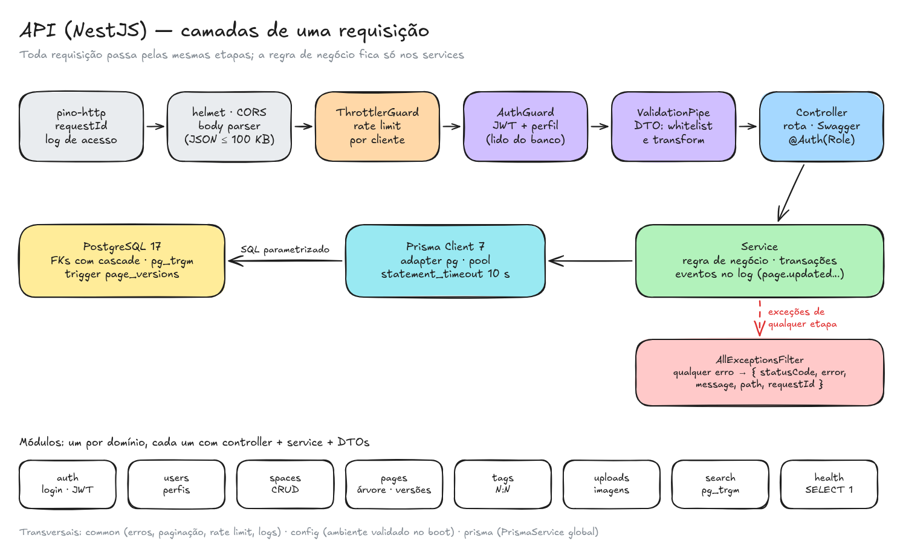

# Backend — camadas da API

A API é um monolito modular em **NestJS 12**: um módulo por domínio, todos sobre o mesmo PostgreSQL via **Prisma 7**. Ela não guarda estado entre requisições (sessão por JWT), então pode rodar com várias réplicas atrás de um balanceador ([Escalabilidade](escalabilidade.md)).



## O caminho de uma requisição

| Etapa | Onde | O que garante |
|---|---|---|
| **pino-http** | `src/common/logging.ts` | Aceita o `x-request-id` do proxy ou gera um id, devolve o id na resposta e escreve uma linha de log de acesso ao final ([Observabilidade](observabilidade.md)) |
| **helmet, CORS, body parser** | `src/app.setup.ts` | Headers de segurança, CORS restrito a uma origem e JSON de até 100 KB (acima disso, 413) |
| **ThrottlerGuard** | `src/common/throttle.ts` | Rate limit por cliente: 10/min no login e no cadastro, 30/min na busca e nos uploads, 120/min por rota nas escritas |
| **AuthGuard** | `src/auth/auth.guard.ts` | Valida o JWT (HS256 fixo) e carrega a conta e o **perfil atual** do banco. Responde 401 sem token válido e 403 abaixo do perfil mínimo da rota |
| **ValidationPipe** | global | DTOs com class-validator: `whitelist` + `forbidNonWhitelisted` (campo desconhecido vira 400) e `transform` (trim, minúsculas, normalização de tags) |
| **Controller** | `src/*/…controller.ts` | Rota, parâmetros (`ParseIdPipe` normaliza uuids) e documentação Swagger (gerada dos comentários dos DTOs) |
| **Service** | `src/*/…service.ts` | Regra de negócio, transações e eventos de log (`page.updated`, `user.role_changed`…) |
| **Prisma** | `src/prisma/prisma.service.ts` | Um único client (pool do `pg`), timeout de conexão de 5 s e `statement_timeout` de 10 s |
| **AllExceptionsFilter** | `src/common/all-exceptions.filter.ts` | Qualquer erro sai em `{ statusCode, error, message, path, requestId, timestamp }`, em português e sem stack trace |

Os decorators deixam a regra de cada rota explícita, na ordem em que ela roda:

```ts
@Patch('pages/:id')
@Auth(Role.EDITOR)   // AuthGuard + perfil mínimo + Swagger (401/403)
@WriteThrottle()     // 120 escritas por minuto por cliente (conta antes do AuthGuard)
update(@Param('id', ParseIdPipe) id: string, @Body() dto: UpdatePageDto, @CurrentUser() user: AuthenticatedUser) {
  return this.pages.update(id, dto, user.id);
}
```

## Módulos

| Módulo | Rotas | Destaques |
|---|---|---|
| `auth` | `POST /auth/register`, `POST /auth/login`, `GET /auth/me` | bcrypt custo 10; 401 genérico no login, rodando o bcrypt mesmo quando o e-mail não existe; conta nova entra como Leitor |
| `users` | `GET /users`, `PATCH /users/:id/role` | Só Admin; o último Admin não pode ser rebaixado (409, com as linhas travadas por `FOR UPDATE`) |
| `spaces` | CRUD `/spaces` | Excluir espaço exige Admin e leva as páginas por cascade |
| `pages` | `/spaces/:id/pages`, `/pages/:id`, `/pages/:id/versions`, `/navigation` | Árvore com até 10 níveis, sem ciclo; concorrência otimista; histórico por trigger; tags |
| `tags` | `GET /tags`, `GET /tags/:nome/pages` | Nome canônico; só lista tags em uso |
| `uploads` | `POST /uploads`, `GET /uploads/:id` | Tipo conferido pelos bytes (PNG, JPEG, GIF, WebP); deduplicação por sha256; cache imutável + ETag |
| `search` | `GET /search` | `ILIKE` com GIN `pg_trgm`, trecho com o termo destacado |
| `health` | `GET /health` | `SELECT 1`: 503 quando o banco não responde (healthcheck do compose) |

Transversais: `common` (erros, paginação `{ data, meta }`, rate limit, IP do cliente, logs), `config` (variáveis de ambiente validadas no boot) e `prisma` (o `PrismaService` global).

## Regras que dependem de transação

- **Criar ou mover página** trava a linha do espaço (`SELECT … FOR UPDATE`). Assim, duas mudanças de estrutura no mesmo espaço entram em fila, e a checagem de ciclo e profundidade vê a árvore final.
- **Editar página ou espaço** é um único `UPDATE … WHERE id = :id AND version = :lida`. Se nenhuma linha casar, outra pessoa salvou antes e a resposta é 409 ([ADR 005](../adr/005-concorrencia-otimista.md)). O trigger `pages_save_version` copia o texto anterior na mesma transação ([ADR 007](../adr/007-historico-de-versoes.md)).
- **Tags novas** entram com `INSERT … ON CONFLICT DO NOTHING` antes de ligar à página ([ADR 011](../adr/011-tags.md)).
- **Trocar perfil** trava as contas Admin para contar quantas restam ([ADR 012](../adr/012-perfis-de-acesso.md)).

## Configuração

Toda variável é validada no boot (`src/config/env.validation.ts`): um ambiente inválido derruba a API na subida, não na primeira requisição.

| Variável | Regra |
|---|---|
| `DATABASE_URL` | obrigatória |
| `JWT_SECRET` | obrigatória, no mínimo 32 caracteres |
| `INTERNAL_API_SECRET` | opcional, no mínimo 32 caracteres; sem ela o IP repassado pelo frontend é ignorado |
| `CORS_ORIGIN` | origem exata (sem barra no fim, sem `*`) |
| `PORT` | 1 a 65535 |
| `LOG_LEVEL` / `LOG_PRETTY` | nível do pino / logs legíveis em desenvolvimento |

## Testes

- **Unitários (Jest, Prisma simulado):** regras de negócio dos services, utilitários puros (árvore, trecho da busca, tags, assinatura de imagens), guard e filtro de erros.
- **e2e (supertest + Postgres real):** toda rota nos caminhos felizes e nos erros relevantes, incluindo 401/403 por perfil, 409 de concorrência, 413/415 do upload, 429 do rate limit e o trigger do histórico.
