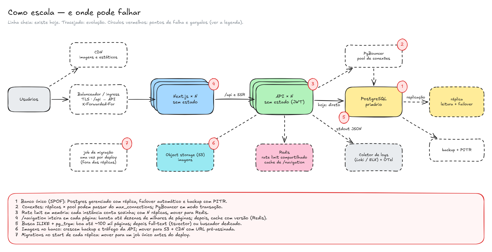

# Pontos de falha e escalabilidade

Hoje o portal roda com uma instância de cada peça, num único host. O desenho já é **sem estado** nas duas aplicações: a sessão é JWT, as imagens ficam no banco e não há arquivo local. Por isso escalar começa por "mais réplicas atrás de um balanceador", e os limites aparecem no que é compartilhado: o banco e o que hoje vive na memória de cada instância.

## O que acontece quando cada peça falha

| Componente | Se falhar | O que o usuário vê | Mitigação hoje | Evolução |
|---|---|---|---|---|
| **PostgreSQL** (①) | Ponto único de falha: leitura e escrita param | Páginas com "não foi possível carregar"; `/health` responde 503 | Healthcheck, volume persistente, `statement_timeout` de 10 s e timeout de conexão de 5 s (falha rápido em vez de travar) | Postgres gerenciado com réplica e **failover automático**, backup contínuo com **PITR** |
| **API** | Uma instância só: escrita e leitura renderizada param | Escritas recebem 502 com a mensagem "Não foi possível conectar à API" (o texto do editor não se perde); as páginas mostram o erro com "tentar de novo"; a barra lateral avisa que a navegação não carregou | Timeouts no Next (10 s por chamada, 5 s na navegação, 30 s no proxy); o compose só sobe o frontend com a API saudável | N réplicas atrás do balanceador, com *readiness* em `/health` e reinício automático |
| **Frontend (Next)** | Uma instância só: o portal fica inacessível | Erro de conexão no navegador | — | N réplicas; páginas sem estado |
| **Proxy `/api` no Next** | O Next fora derruba também as escritas, mesmo com a API saudável | Igual ao frontend fora do ar | — | Em produção, o ingress manda `/api` direto para a API ([ADR 008](../adr/008-proxy-da-api-no-frontend.md)) |
| **Migrations e seed no start** (⑦) | Uma migration com erro impede a API de subir; com várias réplicas, todas tentam migrar | A versão nova não sobe (a antiga continua, se o deploy for gradual) | `prisma migrate deploy` usa *advisory lock*; o seed é idempotente e roda numa transação com *advisory lock* | Um **job de migração** único antes do deploy; migrations compatíveis com a versão anterior (*expand/contract*) |
| **Disco do banco** | Cheio: escritas falham | Erro ao salvar ou enviar imagem | Teto de 5 MB por imagem e deduplicação por sha256 | Alerta de uso de disco; imagens no object storage (⑥) |
| **Segredos padrão** | `JWT_SECRET` público em produção permite forjar tokens | — | A API avisa no log quando sobe com os valores de desenvolvimento; as portas ficam só em `127.0.0.1` | Segredos por ambiente (secret manager) |

## Gargalos e como contornar

Os números entre parênteses ligam cada item ao diagrama.

**④ `/navigation` em toda página.** O layout de toda página pede a navegação inteira: todos os espaços com todas as árvores, sem conteúdo. São 2 queries com índice, montadas em O(n), o que é barato até dezenas de milhares de páginas ([ADR 006](../adr/006-cache-da-navegacao.md)). O custo cresce com o total de páginas, e não com o espaço aberto: o payload e o tempo de montagem acompanham o tamanho do portal.

- *Contorno:* cache em Redis com chave por versão (`navigation:v{n}`, com `n` incrementado a cada escrita de espaço ou página), ou carregar só a árvore do espaço aberto, deixando os outros recolhidos e sob demanda.

**⑤ Busca com `ILIKE` + `pg_trgm`.** Com o índice GIN e a ordenação, foram 34 ms com 20 mil páginas, contra 3,4 s sem `ORDER BY` ([ADR 003](../adr/003-busca-trigram.md)). Termos muito comuns devolvem muitas linhas candidatas, e o tempo cresce com o volume. A busca também não tem relevância e é sensível a acentos.

- *Contorno:* full-text do Postgres (`tsvector` com pesos para título e conteúdo, dicionário `portuguese` + `unaccent`, ranking). Para volumes maiores ou busca tolerante a erros de digitação, um buscador dedicado (Meilisearch, OpenSearch) alimentado pelos eventos de escrita.

**② Conexões com o banco.** Cada instância da API abre o próprio pool do `pg` (10 conexões por padrão). Com N réplicas, são N × 10 conexões, e o `max_connections` padrão do Postgres é 100.

- *Contorno:* PgBouncer em modo transação entre a API e o banco, e o tamanho do pool ajustado por réplica.

**③ Rate limit em memória.** O `@nestjs/throttler` conta em memória, por instância. Com 3 réplicas, o limite real de login vira ~30 tentativas por minuto em vez de 10.

- *Contorno:* storage do throttler em **Redis**, compartilhado. O mesmo Redis serve o cache da navegação.

**⑥ Imagens no banco.** Cada imagem servida passa pela API e ocupa uma conexão do pool durante a leitura. O banco e os backups crescem com bytes que não precisam de índice. O cache imutável (1 ano + ETag) faz o navegador pedir cada imagem uma só vez.

- *Contorno:* uma CDN na frente de `/api/uploads/*` resolve o tráfego. Para o volume, a troca de implementação do `UploadsService` para object storage (S3/R2/MinIO), com upload por URL pré-assinada; os ids não mudam ([ADR 010](../adr/010-armazenamento-de-imagens.md)).

**Renderização do Markdown no servidor.** Toda leitura renderiza o Markdown da página: até 50 mil caracteres, com destaque de sintaxe. Isso é CPU por requisição no Next.

- *Contorno:* réplicas do Next, que não têm estado. Se a medição mostrar gargalo, cache do HTML por `(página, versão)`: a página só muda quando a versão muda.

**Histórico sem retenção.** Cada edição de texto grava uma linha em `page_versions` com o conteúdo inteiro. A tabela cresce sem limite.

- *Contorno:* política de retenção (por exemplo, manter as últimas N versões, ou todas dos últimos 90 dias e depois uma por mês) ou particionamento por data.

**Upload em memória.** Cada envio fica em memória até 5 MB enquanto é validado e gravado. O rate limit de 30 envios por minuto por cliente limita o pico.

- *Contorno:* com object storage, a URL pré-assinada tira o arquivo do caminho da API.

**Lock do espaço.** Criar e mover páginas travam a linha do espaço para checar ciclo e profundidade com segurança. Mudanças de estrutura simultâneas **no mesmo espaço** entram em fila. Editar texto não trava nada além da própria página.

## Como o sistema escala

1. **Aplicações na horizontal.** Next e API não guardam estado: N réplicas de cada atrás de um balanceador que termina TLS, encaminha `/api` direto para a API e acrescenta o `X-Forwarded-For` (a premissa do rate limit). O que hoje vive na memória de cada instância (rate limit) vai para o Redis.
2. **Banco na vertical, depois com réplicas.** O Postgres aguenta bem o volume de um portal de documentação numa instância maior. Réplicas de leitura atendem navegação, busca e leitura de páginas, e a escrita continua no primário. O PgBouncer controla as conexões.
3. **Cache em camadas, só onde a medição pedir:**
   - navegador: imagens imutáveis, o que já existe;
   - CDN: imagens e arquivos estáticos do Next;
   - Redis: navegação e rate limit;
   - HTML renderizado por versão de página.
4. **Workloads especializados quando o volume justificar:** object storage para imagens, buscador dedicado para a busca, job único para migrations.

**Ordem que eu seguiria, guiada por medição:**

1. Balanceador + 2 réplicas de cada aplicação + Redis para o rate limit. Isso tira os pontos únicos de falha das aplicações.
2. Postgres gerenciado com failover e PITR. Isso tira o ① e é o maior risco hoje.
3. PgBouncer, assim que o número de réplicas apertar as conexões.
4. CDN para `/api/uploads`, depois object storage.
5. Cache da navegação e busca full-text, quando p95 ou `EXPLAIN ANALYZE` mostrarem gargalo.
6. OpenTelemetry e métricas com alertas ([Observabilidade](observabilidade.md)).

## O que eu mediria antes de mudar

- **Latência p95 por rota**, pelo log de acesso (`responseTime`): principalmente `GET /navigation`, `GET /search` e `GET /pages/:id`.
- **`EXPLAIN (ANALYZE, BUFFERS)`** da navegação e da busca com volume realista (dezenas de milhares de páginas).
- **Conexões em uso** no Postgres (`pg_stat_activity`) com a carga esperada.
- **Tamanho das tabelas** `uploads` e `page_versions` ao longo do tempo.
- **Taxa de 409** nas edições: muitos conflitos indicariam a necessidade de edição colaborativa em tempo real (CRDT), e não de mais capacidade.
