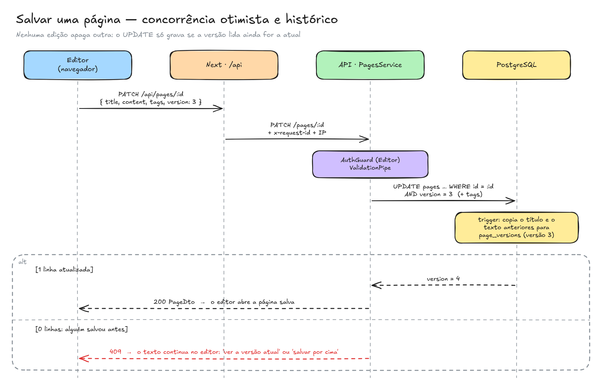
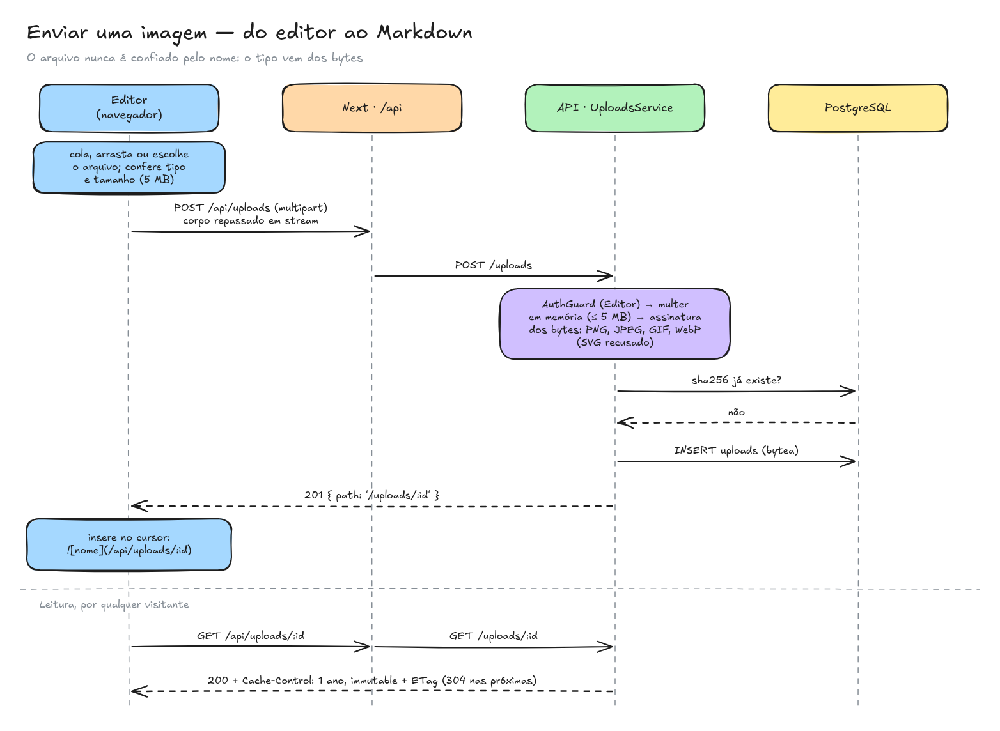

# Fluxos principais

Como as peças conversam nas operações que mais importam. Os nomes de arquivo levam ao código de cada passo.

## Salvar uma página

1. O editor envia `PATCH /api/pages/:id` com `title`, `content`, `tags` e a **`version` que a pessoa abriu**. `parentId` só vai se a página pai mudou: editar o texto nunca move a página por acidente.
2. O proxy do Next repassa a chamada para a API com o `x-request-id` e o IP do visitante.
3. A API confere o perfil (Editor ou Admin) e valida o corpo: título até 200 caracteres, conteúdo até 50 mil, até 10 tags.
4. `PagesService.update` compara o que chegou com o que está gravado. Se nada mudou, devolve a página sem gerar versão nova, e quem edita ao mesmo tempo não leva 409 por uma "alteração" vazia.
5. A gravação é um único `UPDATE pages … WHERE id = :id AND version = :versão_lida`, que incrementa a versão.
   - **1 linha:** gravou. Antes de gravar, o trigger `pages_save_version` copiou o título e o texto anteriores para `page_versions`, na mesma transação.
   - **0 linhas e a página existe:** alguém salvou depois que o editor abriu. A API responde **409** e o texto continua no editor, com "ver a versão atual (nova aba)" e "salvar por cima" (que busca a versão atual e salva de novo).
   - **0 linhas e a página não existe:** 404.
6. Mudar só as tags ou a página pai é metadado: incrementa a versão, mas não entra no histórico nem troca o "editada por".

**Restaurar uma versão** reaproveita o mesmo fluxo. `Histórico → versão N → Restaurar` abre o editor com o texto antigo, e salvar cria uma versão nova: a atual vai para o histórico e nada se perde.

## Enviar uma imagem

1. A pessoa escolhe, cola ou arrasta uma imagem no editor. O navegador já confere formato e tamanho (PNG, JPEG, GIF ou WebP, até 5 MB).
2. `POST /api/uploads` (multipart) passa pelo proxy em stream e chega à API.
3. Primeiro rodam os guards (rate limit de 30/min, AuthGuard com perfil Editor); só então o multer lê o arquivo, em memória e com teto de 5 MB (413 acima disso).
4. O tipo é decidido pela **assinatura dos bytes**, não pelo nome nem pelo `Content-Type`. Um HTML ou SVG chamado `foto.png` recebe 415.
5. Pelo sha256, a API vê se a mesma imagem já existe. Se existe, devolve o registro existente; senão, grava em `uploads` (`bytea`).
6. A resposta traz `path: /uploads/:id`, e o editor insere `` no cursor.
7. Na leitura, `GET /api/uploads/:id` responde com `Cache-Control: public, max-age=31536000, immutable` e `ETag`. O navegador baixa cada imagem uma vez ([ADR 010](../adr/010-armazenamento-de-imagens.md)).

## Entrar e manter a sessão

1. `POST /api/auth/login` passa pelo rate limit de 10 tentativas por minuto por cliente. A resposta é 401 genérico tanto para senha errada quanto para e-mail inexistente, com o mesmo tempo de resposta.
2. A API devolve `{ accessToken, user: { id, name, email, role } }`. O JWT vale 8 h.
3. O `AuthProvider` grava o token no `localStorage` e, a cada carregamento, confere com `GET /auth/me`. Só um 401 apaga o token; uma API fora do ar não desloga ninguém.
4. Em toda escrita, o `AuthGuard` lê o perfil **no banco**, então uma promoção ou um rebaixamento valem na hora.

## Ler uma página

1. `GET /pages/:id` chega ao frontend, e o Server Component busca a página e a navegação em paralelo.
2. A navegação (`GET /navigation`) traz todos os espaços com as árvores de páginas, sem o conteúdo, em 2 queries montadas em O(n). Essa chamada é o principal ponto de atenção ao crescer ([Escalabilidade](escalabilidade.md)).
3. O Markdown é renderizado no servidor, sem HTML cru. O sumário sai dos títulos.

## Buscar

1. O termo vai para `GET /api/search?q=…` (30 buscas por minuto por cliente). Ele precisa ter ao menos 3 letras ou dígitos seguidos, para o índice de trigramas ser usado.
2. A consulta é `ILIKE '%termo%'` em título e conteúdo, com índice GIN `pg_trgm`, ordenada por última edição ([ADR 003](../adr/003-busca-trigram.md)).
3. Cada resultado traz um trecho do conteúdo em volta do termo, já sem a marcação Markdown, e o frontend destaca o termo.
