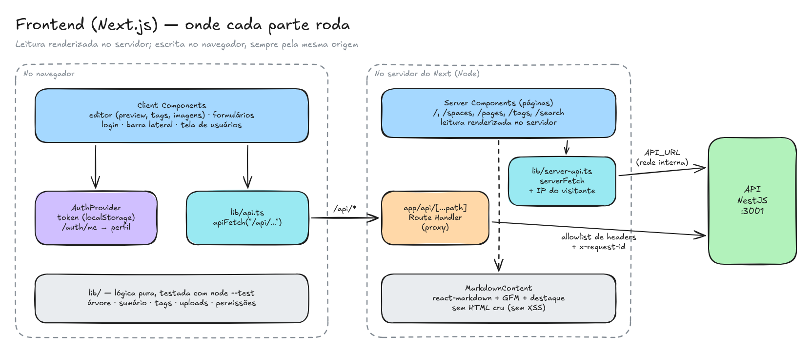

# Frontend — o que roda no servidor e o que roda no navegador

O frontend é um app **Next.js 16 (App Router)** com React 19 e Tailwind CSS 4. A regra geral: **leitura renderizada no servidor** (o HTML já chega pronto e indexável) e **escrita no navegador** (formulários interativos), sempre pela mesma origem.

## Server Components: leitura

As rotas de leitura (`/`, `/spaces/[id]`, `/pages/[id]`, `/pages/[id]/versions`, `/tags`, `/tags/[nome]`, `/search`) são Server Components:

- buscam os dados com `serverFetch` (`src/lib/server-api.ts`) direto na API, pela rede interna (`API_URL=http://backend:3001`);
- repassam o IP de quem pediu a página (`x-portal-client-ip` + segredo compartilhado), para o rate limit da API valer por visitante e não pelo container do frontend;
- têm teto de tempo: 10 s por chamada e 5 s para a navegação da barra lateral, que o layout de toda página espera;
- aceitam só ids no formato uuid antes de chamar a API. Assim, um parâmetro como `..%2Fauth%2Fme` não vira outro caminho.

A navegação da barra lateral (`GET /navigation`) é buscada uma vez por requisição (`cache()` do React) e compartilhada entre o layout e a página.

## Client Components: escrita e interação

Editor, formulários, login, barra lateral recolhível e tela de usuários são Client Components. Eles chamam a API com `apiFetch` (`src/lib/api.ts`), que no navegador usa a base **`/api`**:

- `app/api/[...path]/route.ts` (Route Handler) repassa a chamada para a API;
- a parte pura do proxy (montar a URL de destino, filtrar cabeçalhos, erros 502/504 no formato da API) fica em `src/lib/proxy.ts`, com testes;
- não há CORS nem URL da API embutida no bundle, e o portal funciona por qualquer host que alcance a porta 3000 ([ADR 008](../adr/008-proxy-da-api-no-frontend.md)).

## Sessão e perfis

- O `AuthProvider` guarda o token JWT no `localStorage` e restaura a sessão com `/auth/me`, tentando de novo uma vez se a API piscar. Ele também acompanha o login feito em outra aba.
- O perfil (Admin, Editor ou Leitor) vem no usuário. `AuthOnly role="EDITOR"` esconde botões e `RequireAuth role="EDITOR"` protege as telas de escrita. Quem garante a regra é a API (403), e a interface só não oferece o que vai falhar ([ADR 012](../adr/012-perfis-de-acesso.md)).
- O Admin vê **Usuários** no header (`/admin/usuarios`) para trocar perfis.

## Editor de páginas

- **Texto e preview lado a lado** (abas no celular). O preview usa `useDeferredValue` + `memo`: digitar nunca espera o parse do Markdown.
- **Tags** como chips, normalizadas com a mesma regra da API (`src/lib/tags.ts`).
- **Imagens** pelo botão, colando ou arrastando para o texto. O editor confere formato e tamanho, envia para `/api/uploads` e insere `` no cursor (`src/lib/uploads.ts`).
- **Proteção do texto:** aviso ao sair com alterações não salvas (inclusive pelos links da barra lateral). Num conflito de versão (409), o texto continua no editor, com "ver a versão atual" e "salvar por cima". Com a sessão expirada (401), dá para entrar de novo em outra aba sem perder nada.

## Markdown

`MarkdownContent` (react-markdown + remark-gfm + rehype-slug + rehype-highlight) é o mesmo componente na leitura, no preview do editor e no histórico:

- **sem HTML cru** (sem `rehype-raw`): HTML escrito no Markdown é descartado, o que fecha a principal porta de XSS;
- links externos abrem em outra aba com `noopener noreferrer`; links internos usam a navegação do cliente;
- os títulos geram âncoras e o sumário "Nesta página" (`src/lib/toc.ts`);
- as imagens ganham moldura e fundo claro, para os diagramas ficarem legíveis no tema escuro.

## Lógica pura e testes

Tudo o que é regra fica em `src/lib`, sem React, e é testado com `node --test`:

- árvore e caminho até a página;
- sumário;
- redirect seguro após o login;
- destaque da busca e paginação;
- aviso de texto não salvo;
- cliente da API e proxy;
- permissões, tags e uploads.

## Segurança no frontend

- Headers em todas as respostas: `X-Content-Type-Options`, `Referrer-Policy`, `X-Frame-Options: DENY` e `Permissions-Policy`. Não há `X-Powered-By`.
- O redirect após o login só aceita caminhos internos.
- O proxy só repassa uma allowlist de cabeçalhos: cookies e cabeçalhos `x-portal-*` forjados pelo cliente não chegam à API.

Mais em [Segurança](../seguranca.md).
