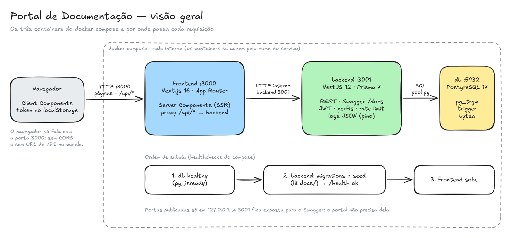

# Arquitetura — visão geral

O portal é uma aplicação web de documentação. **Espaços** agrupam **páginas em Markdown**, organizadas em árvore, com busca, histórico de versões, tags, imagens e perfis de acesso. São três peças, uma por container: o **frontend** (Next.js), a **API** (NestJS) e o **banco** (PostgreSQL).



## As três peças

| Peça | Tecnologia | O que faz |
|---|---|---|
| **frontend** `:3000` | Next.js 16 (App Router), React 19, Tailwind CSS 4 | Renderiza as páginas de leitura no servidor (Server Components). Tem os formulários e o editor no navegador (Client Components). Repassa as chamadas do navegador para a API (`/api/*`). |
| **backend** `:3001` | NestJS 12, Prisma 7, pino | API REST com Swagger: autenticação JWT, perfis, espaços, páginas, histórico, tags, imagens, busca e health check. |
| **db** `:5432` | PostgreSQL 17 | Dados relacionais com integridade no banco (FKs com cascade), busca por trigramas (`pg_trgm`), histórico gravado por trigger e imagens em `bytea`. |

O navegador só conversa com o frontend. A API fica na rede interna do Compose, e a porta 3001 é publicada apenas para o Swagger ([ADR 008](../adr/008-proxy-da-api-no-frontend.md)).

## Como uma requisição passa

**Leitura** (abrir uma página):

1. O navegador pede `/pages/:id` ao frontend.
2. O Server Component busca a página e a navegação da barra lateral na API, pela rede interna (`serverFetch` em `http://backend:3001`). Junto, repassa o IP do visitante, para o rate limit valer por pessoa.
3. O HTML chega pronto: Markdown renderizado, sumário, caminho (breadcrumb), autoria e tags.

**Escrita** (salvar uma página):

1. O editor, um Client Component, chama `PATCH /api/pages/:id` na própria origem do portal.
2. O Route Handler `app/api/[...path]` repassa a chamada para a API, com uma allowlist de cabeçalhos, o IP do visitante e um `x-request-id`.
3. A API confere o token e o perfil e valida o corpo. Em seguida, grava numa transação com concorrência otimista, e um trigger guarda o texto anterior no histórico.

Os passos em detalhe estão em [Fluxos principais](fluxos.md).

## Camadas

- **[Backend](backend.md):** o caminho de uma requisição dentro da API (logs, guards, validação, controller, service, Prisma) e os módulos por domínio.
- **[Frontend](frontend.md):** o que roda no servidor e o que roda no navegador, como a sessão funciona e como o Markdown é renderizado.
- **[Banco de dados](../banco-de-dados.md):** tabelas, índices, trigger e migrations.
- **[Observabilidade](observabilidade.md):** logs estruturados com id de requisição.
- **[Pontos de falha e escalabilidade](escalabilidade.md):** o que acontece quando cada peça falha, onde estão os gargalos e como o sistema cresce.

## Tecnologias e por quê

| Tema | Escolha | Por quê |
|---|---|---|
| Banco | PostgreSQL 17 | Dados relacionais com integridade, cascade e busca por substring indexada, sem infraestrutura extra ([ADR 001](../adr/001-banco-de-dados-postgresql.md)) |
| ORM | Prisma 7 (adapter `pg`) | Schema declarativo, migrations versionadas e tipos gerados |
| Árvore | Lista de adjacência | Mover é um `UPDATE`; a navegação inteira sai em 2 queries ([ADR 002](../adr/002-modelagem-da-arvore.md)) |
| Busca | `ILIKE` + GIN `pg_trgm` | Acha trechos de palavras com índice ([ADR 003](../adr/003-busca-trigram.md)) |
| Autenticação | JWT HS256, bcryptjs | Sem sessão no servidor ([ADR 004](../adr/004-autenticacao-jwt.md)) |
| Edição concorrente | Concorrência otimista (`version`) | Uma edição não apaga outra, sem lock ([ADR 005](../adr/005-concorrencia-otimista.md)) |
| Cache | Nenhum por enquanto | A navegação já é barata; cache só com medição ([ADR 006](../adr/006-cache-da-navegacao.md)) |
| Histórico | Trigger no Postgres | Atômico com o `UPDATE`, vale para qualquer escrita ([ADR 007](../adr/007-historico-de-versoes.md)) |
| Navegador → API | Proxy `/api` no Next | Mesma origem: sem CORS e sem URL da API no build ([ADR 008](../adr/008-proxy-da-api-no-frontend.md)) |
| Logs | pino (JSON) | Uma linha por evento, com `requestId` de ponta a ponta ([ADR 009](../adr/009-logs-estruturados.md)) |
| Imagens | `bytea` no Postgres | Nenhuma peça nova, e qualquer réplica serve qualquer imagem ([ADR 010](../adr/010-armazenamento-de-imagens.md)) |
| Tags | Tabelas `tags` + `page_tags` | Nome normalizado, contagem por tag com índice ([ADR 011](../adr/011-tags.md)) |
| Perfis | Admin, Editor e Leitor | Perfil global, lido do banco a cada requisição ([ADR 012](../adr/012-perfis-de-acesso.md)) |
| Markdown | react-markdown + remark-gfm + rehype-highlight | Sem HTML cru (seguro por padrão); o mesmo componente na leitura, no preview e no histórico |

## Subida com um comando

`docker compose up --build` sobe tudo na ordem certa, com base nos healthchecks:

1. **db** fica *healthy* quando o `pg_isready` responde por TCP.
2. **backend** aplica as migrations (`prisma migrate deploy`) e roda o seed. O seed é idempotente e lê esta documentação de `docs/`. Depois a API sobe e fica *healthy* quando `/health` consegue consultar o banco.
3. **frontend** só sobe depois da API saudável.

As portas ficam só em `127.0.0.1`, e os containers da API e do frontend rodam sem root e com `no-new-privileges` ([Segurança](../seguranca.md)).

## Onde está cada coisa

```
backend/
  prisma/       schema, migrations (com SQL manual: pg_trgm, trigger, storage do bytea), seed
  src/          auth, users, spaces, pages, tags, uploads, search, health,
                common (erros, paginação, rate limit, logs), config (ambiente validado no boot)
  test/         e2e (supertest + Postgres real)
frontend/src/
  app/          rotas: /, /spaces, /pages (+ /versions), /tags, /search, /admin/usuarios,
                /login, /register e o proxy /api/[...path]
  components/   shell (header, barra lateral), Markdown, editor, tags, formulários
  lib/          cliente da API, proxy, permissões, tags, uploads: lógica pura testada
docs/           esta documentação, os ADRs e os diagramas (fonte do conteúdo do portal)
```

## Este portal documenta a si mesmo

O conteúdo de exemplo do portal **é esta documentação**. No primeiro boot, o seed lê os arquivos Markdown de `docs/` e os diagramas de `docs/diagramas/` e faz o seguinte:

- envia os diagramas como imagens (uploads);
- cria os espaços e as páginas com tags e autores;
- troca os links entre documentos por links para as páginas do portal.

O que você lê aqui e o que está no repositório são o mesmo texto.
