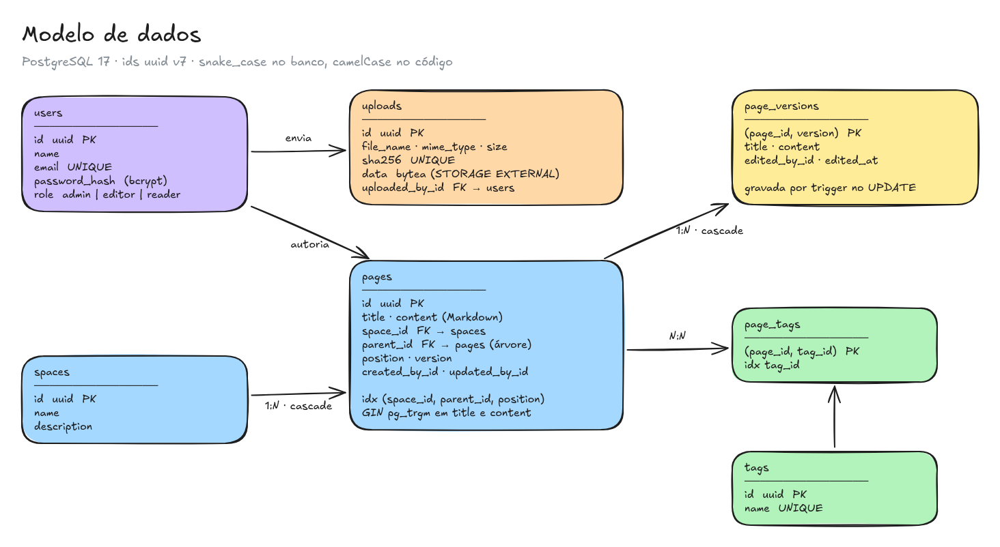

# Banco de dados

PostgreSQL 17 com Prisma 7 ([ADR 001](adr/001-banco-de-dados-postgresql.md)). O schema está em [`backend/prisma/schema.prisma`](../backend/prisma/schema.prisma), e as migrations rodam sozinhas no start do backend (`prisma migrate deploy`).

## Tabelas

| Tabela | Campos principais |
|---|---|
| `users` | `id` (uuid v7), `name`, `email` (único, minúsculas), `password_hash`, `role` (`admin`, `editor` ou `reader`; padrão `reader`), datas |
| `spaces` | `id`, `name`, `description?`, datas |
| `pages` | `id`, `title`, `content` (Markdown), `space_id` → spaces (**cascade**), `parent_id?` → pages (**cascade**), `position`, `version`, `created_by_id` / `updated_by_id` → users, datas |
| `page_versions` | `(page_id, version)` (chave), `title`, `content`, `edited_by_id` → users, `edited_at`; `page_id` → pages (**cascade**) |
| `tags` | `id`, `name` (único, já normalizado: minúsculas e hífens), `created_at` |
| `page_tags` | `(page_id, tag_id)` (chave); os dois lados com **cascade** |
| `uploads` | `id`, `file_name`, `mime_type`, `size`, `sha256` (único), `data` (`bytea`), `uploaded_by_id` → users, `created_at` |

- Ids **uuid v7**: ordenados no tempo, as inserções caem no fim do índice da chave primária (o v4 aleatório espalha as páginas do B-tree).
- Árvore por **lista de adjacência** (`parent_id`): mover uma página é um `UPDATE`, e a navegação de todos os espaços sai em 2 queries (espaços e páginas, sem o conteúdo), montada em memória em O(n) ([ADR 002](adr/002-modelagem-da-arvore.md)).
- `version` serve à concorrência otimista ([ADR 005](adr/005-concorrencia-otimista.md)) e numera o histórico.
- `role` é um enum do Postgres (`user_role`), lido pelo `AuthGuard` a cada requisição autenticada ([ADR 012](adr/012-perfis-de-acesso.md)).
- Tags em tabela própria, N:N com páginas ([ADR 011](adr/011-tags.md)). Trocar as tags de uma página não passa pelo trigger do histórico.
- Imagens no próprio banco ([ADR 010](adr/010-armazenamento-de-imagens.md)): `data` usa `STORAGE EXTERNAL`, ou seja, fica fora da linha (TOAST) e não é recomprimido, porque PNG, JPEG, GIF e WebP já vêm comprimidos.

## Histórico de versões

O trigger `pages_save_version` roda `BEFORE UPDATE OF title, content` e, quando o título ou o conteúdo mudam de fato, copia o estado anterior da página (título, conteúdo, quem escreveu e quando) para `page_versions`. Fica atômico com a gravação e vale para qualquer `UPDATE`. Mover a página sem editar o texto não gera versão nem troca o "editada por/em" ([ADR 007](adr/007-historico-de-versoes.md)).

## Índices e por quê

- `pages (space_id, parent_id, position)` — serve a montagem das árvores (e, pelo prefixo à esquerda, consultas só por espaço).
- `pages (parent_id)` — o Postgres não indexa FKs sozinho; o `ON DELETE CASCADE` da hierarquia procura as filhas por ele.
- GIN `gin_trgm_ops` em `pages.title` e `pages.content` — busca por substring (`ILIKE '%termo%'`), que um B-tree não atende ([ADR 003](adr/003-busca-trigram.md)). A busca sempre ordena (`updated_at`, `id`): sem `ORDER BY`, só com `LIMIT`, o planner preferia varrer a tabela (3,4 s contra 34 ms com 20 mil páginas).
- `page_versions (page_id, version)` — a própria chave atende a listagem do histórico por página.
- `page_tags (page_id, tag_id)` + `page_tags (tag_id)` — a chave atende "tags da página"; o índice em `tag_id` atende "páginas da tag" e o cascade ao excluir uma tag.
- `tags (name)` e `uploads (sha256)` únicos — uma tag por nome, e uma linha por arquivo: enviar a mesma imagem de novo reaproveita o registro.
- As FKs de autor (`created_by_id`, `updated_by_id`, `edited_by_id`, `uploaded_by_id`) ficam **sem** índice de propósito: usuários nunca são excluídos, então o índice só encareceria cada escrita.

## Migrations

| Migration | O quê |
|---|---|
| `create_users` | usuários |
| `create_spaces_and_pages` | espaços, páginas, FKs e índices da árvore |
| `add_trigram_search_indexes` | extensão `pg_trgm` e índices GIN (SQL manual) |
| `drop_unused_page_author_indexes` | remove índices de autor que só custavam escrita |
| `add_page_versions` | tabela do histórico e o trigger (SQL manual) |
| `add_user_roles` | enum `user_role` e `users.role`; as contas existentes viram `editor` e a mais antiga vira `admin` (SQL manual) |
| `add_page_tags` | `tags` e `page_tags` |
| `add_uploads` | `uploads`, com `data` em `STORAGE EXTERNAL` (SQL manual) |

As migrations com SQL manual são criadas com `npx prisma migrate dev --config prisma7.config.ts --create-only --name <nome>`, e o SQL é acrescentado ao arquivo gerado antes de aplicar.

O seed (`backend/prisma/seed.ts`) roda a cada start, numa transação com *advisory lock*:

- **sempre** garante as três contas de demonstração (Admin, Editor e Leitor) com o perfil certo;
- **só num banco sem espaços**, cria o conteúdo do portal a partir desta pasta `docs/`, com os diagramas enviados como uploads.
